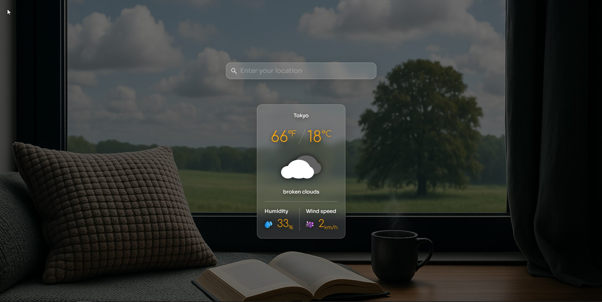

# 🌦️ Current Weather Webpage

This is a simple and responsive **Current Weather Webpage** built using **HTML, CSS, and JavaScript**. The project was created to understand how to work with **APIs**, update the UI dynamically, and make a weather interface visually appealing and mobile-friendly.

## 🔗 Live Preview

[Watch the Live Demo of my Website](https://current-weather1.netlify.app/)

## 🚀 Features

- 🌐 **Real-time weather data** using [OpenWeatherMap API](https://openweathermap.org/api)
- 🎨 **Dynamic background** that changes based on the weather
- 📱 Fully **responsive design**
- 📍 User can search any city to get weather details
- 🌡️ Displays temperature (in °C and °F), weather condition, humidity, and wind speed
- ⚠️ Handles errors (invalid input or network issues)

## 🛠️ Tech Stack

- **HTML** - Page structure  
- **CSS** - Custom styling and layout  
- **JavaScript** - Fetching API, DOM manipulation, error handling

## 📚 What I Learned

- How to fetch and manage data using **REST APIs**
- How to handle asynchronous operations and errors
- How to dynamically update UI content and style based on data
- Basics of **responsive design** and clean CSS structure

## 📸 Preview

## 📄 License

This project is licensed under the [MIT License](LICENSE).

---

*Built with ☕ and curiosity.*
